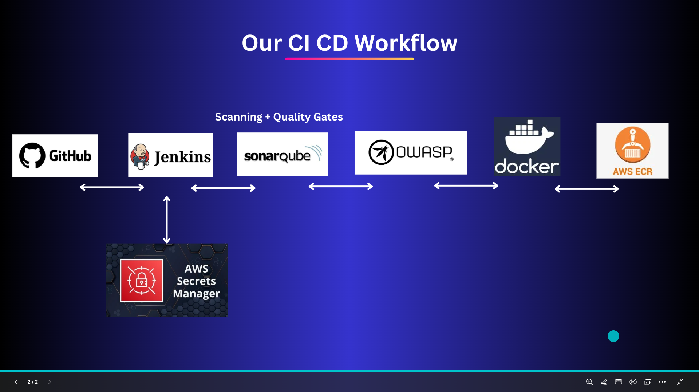

# Jenkins CI/CD Pipeline with SonarQube, OWASP Dependency Check, AWS ECR, and AWS Secrets Manager

## 📌 Project Overview
This project demonstrates a **Jenkins CI/CD pipeline** that automates the process of building, analyzing, securing, and deploying a Dockerized application to **Amazon Elastic Container Registry (ECR)**.  

The pipeline includes:
- **GitHub Source Integration** – Pulls the application code from GitHub.  
- **Static Code Analysis with SonarQube** – Ensures code quality and maintainability.  
- **Dependency Scanning with OWASP Dependency-Check** – Identifies vulnerable dependencies.  
- **Docker Image Build** – Builds a container image from the application code.  
- **Image Push to AWS ECR** – Securely pushes the built image to AWS ECR.  
- **Secrets Management with AWS Secrets Manager** – Stores sensitive information such as AWS credentials, repository URIs, and other Jenkins secrets securely.  
- **Post-Build Cleanup** – Removes unused images from Jenkins agent to save space.  

---

## ⚙️ Pipeline Workflow
  

1. **Checkout Code**  
   - Clones the source code from GitHub (`main` branch).

2. **Static Code Analysis (SonarQube)**  
   - Runs `sonar-scanner` with project-specific details.  
   - Ensures code adheres to quality and reliability standards.  

3. **Dependency Security Check (OWASP)**  
   - Scans dependencies for known vulnerabilities.  
   - Generates security reports.
   - Enable SonarQube **Quality Gate** stage (currently commented in pipeline).  

4. **Docker Image Build**  
   - Builds the Docker image using the provided `Dockerfile`.  

5. **Push to AWS ECR**  
   - Authenticates with AWS ECR using `aws ecr get-login-password`.  
   - Tags the image correctly and pushes it to the AWS ECR repository.  

6. **Cleanup**  
   - Removes local Docker images and prunes unused layers.  

---

## 🔑 Prerequisites
To run this pipeline successfully, ensure the following are available:

1. **Jenkins Setup**
   - Jenkins installed with the following plugins:
     - Git Plugin  
     - Pipeline Plugin  
     - SonarQube Scanner for Jenkins  
     - OWASP Dependency-Check Plugin  
     - Docker Pipeline Plugin  
   - AWS CLI installed on Jenkins agent  

2. **SonarQube**
   - SonarQube server running and accessible from Jenkins.  
   - SonarQube tool configured in Jenkins (e.g., name: `Sonar`).  
   - SonarQube project and token configured.  

3. **OWASP Dependency-Check**
   - Installed and configured in Jenkins (installation name: `DP-Check`).  

4. **AWS Setup**
   - AWS CLI installed and configured on Jenkins agents.  
   - AWS ECR repository created in AWS account.  
   - **AWS Secrets Manager used to securely store Jenkins credentials** such as:
     - Repository URI  
     - Image repo name  
     - Region  
     - Account ID  
     - AWS authentication keys  

---

## 🔧 Jenkins Pipeline Parameters
| Parameter Name   | Description                                                                 |
|------------------|-----------------------------------------------------------------------------|
| `DEPLOY_VERSION` | The version tag for the Docker image. This will be used in build and deploy.|

---

## 🌐 Environment Variables in Jenkinsfile
| Variable        | Description |
|-----------------|-------------|
| `IMAGE_TAG`     | Docker image tag (taken from `DEPLOY_VERSION`). |
| `REPOSITORY_URI`| AWS ECR repository URI (retrieved from AWS Secrets Manager). |
| `IMAGE_REPO_NAME`| Name of the Docker image repository (retrieved from AWS Secrets Manager). |
| `REGION`        | AWS region where ECR is created (retrieved from AWS Secrets Manager). |
| `ACCOUNT_ID`    | AWS Account ID (retrieved from AWS Secrets Manager). |
| `SONAR_HOME`    | Path to the SonarQube scanner tool. |

## ⚙️ Secrets in Secret Manager AWS
 
---

## 🚀 Running the Pipeline
1. Commit and push your changes to the GitHub repository.  
2. In Jenkins, create a new pipeline project and point it to this repository.  
3. Add required secrets in **AWS Secrets Manager**, and configure Jenkins to fetch them dynamically.  
4. Run the pipeline and provide `DEPLOY_VERSION` when prompted.  
5. Verify the Docker image is available in your AWS ECR repository.  

---

## 📊 Security & Quality Tools
- **SonarQube**: Helps maintain clean, safe, and reliable code.  
- **OWASP Dependency-Check**: Detects security vulnerabilities in project dependencies.  
- **AWS Secrets Manager**: Protects sensitive data by avoiding plain text credentials in Jenkins.  

---

## 🧹 Cleanup Policy
After every build, the pipeline automatically:
- Removes local Docker images built during the pipeline run.  
- Prunes unused Docker layers to free disk space.  

---

## 📌 Future Enhancements
- Add automated deployment to AWS ECS or Kubernetes (EKS).  
- Add email or Slack notifications for build results.  

---

